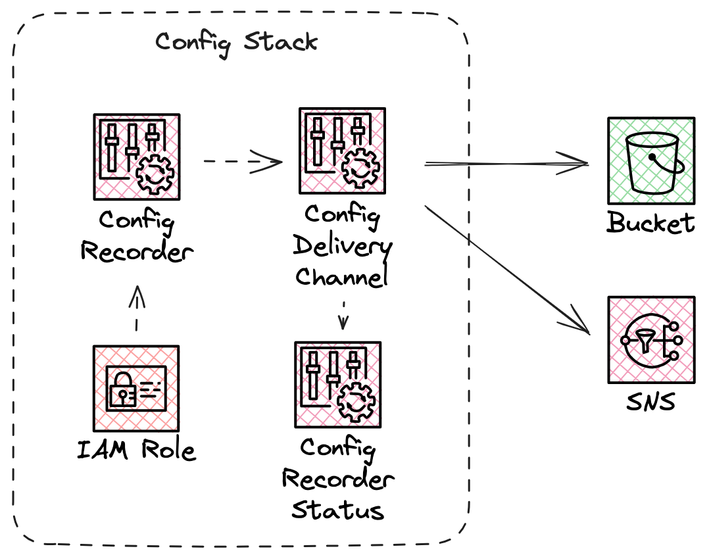

# Observe AWS Config Setup

The Observe AWS Config stack automates the setup of AWS Config to capture detailed configuration information of AWS resources.

## Overview

This stack sets up AWS Config to record configuration changes and resource relationships within your AWS environment.

The stack provisions the following resources:

- **ConfigurationRecorderRole**: An IAM role that allows AWS Config to assume it and grants necessary permissions for recording and delivering configurations.
- **ConfigurationRecorder**: The AWS Config recorder to track resource configurations and changes.
- **ConfigurationDeliveryChannel**: The delivery channel that defines where recorded data is stored and how often it is delivered.

Once deployed, AWS Config will start recording configurations for supported AWS resources and resource relationships. It will store the configuration history in the specified S3 bucket and deliver configuration snapshots at the specified frequency.

## Configuration Parameters

The following parameters are required for stack configuration:

| Parameter       | Type    | Description |
|-----------------|---------|-------------|
| **`BucketName`** | String | The name of the S3 bucket used to store the configuration history. |
| `TopicARN` | String | The ARN of the SNS topic that AWS Config delivers notifications to. |
| `IncludeResourceTypes` | CommaDelimitedList | Resources to collect using AWS Config. Use a wildcard to collect all supported resource types. If set to blank, installing this stack will have no effect. |
| `ExcludeResourceTypes` | CommaDelimitedList | Exclude a subset of resource types from configuration collection. This parameter can only be set if IncludeResourceTypes is wildcarded. |
| `IncludeGlobalResourceTypes` | String | Specifies whether AWS Config includes all supported types of global resources with the resources that it records. This field only takes effect if all resources are included for collection. IncludeResourceTypes must be set to *, and ExcludeResourceTypes must not be set. |
| `Prefix` | String | The prefix for the specified Amazon S3 bucket. |
| `DeliveryFrequency` | String | The frequency with which AWS Config delivers configuration snapshots. |
