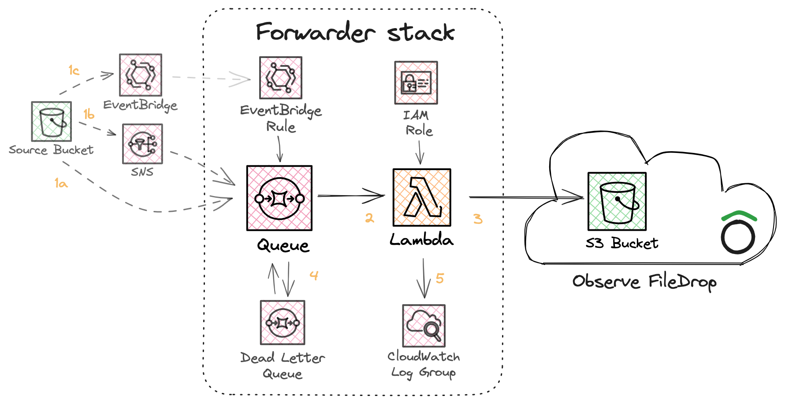

# Observe Forwarder Application

The Observe Forwarder is an AWS Serverless Application Model (SAM) application designed to route data to an Observe Filedrop. It can be configured to handle files from S3 buckets and ingest event streams from SQS queues, including SNS or EventBridge events.

## How it works

The Forwarder stack provisions a set of AWS resources that work together to capture data events and forward them to the specified Filedrop destination in Observe. The Forwarder stack provisions:

- **SQS Queue**: Receives events from S3 buckets or SNS topics.
- **Lambda Function**: Processes messages from the SQS queue and forwards them to Filedrop.
- **IAM Role**: Grants the Lambda function permissions to write to Filedrop.
- **CloudWatch Log Group**: Captures logs from the Lambda function.
- **Dead Letter Queue**: Receives messages that fail to be processed after several attempts.
- **EventBridge Rule**: Triggers the SQS queue for `s3:ObjectCreated` events that are emitted to the default EventBridge bus.



The flow for copying objects from a _source bucket_ into Observe is as follows:

1. An S3 event notification of object creation must be delivered to the SQS queue provisioned as part of the Forwarder stack. There are three supported methods for notification delivery:
    - a) directly to SQS
    - b) via SNS
    - c) via EventBridge

2. The Forwarder lambda function batches tasks from the Queue for processing.

3. All tasks are written to Filedrop with content-type `application/x-aws-sqs`. Any S3 event notification the Lambda receives from a _source bucket_ will trigger an S3 CopyObject action for the source object towards Filedrop.

4. Any failed tasks will be returned to the SQS queue. Repeated failures will causes tasks to be moved to a dead letter queue.

5. Logs are written the Lambda function's CloudWatch Log Group. This is the best place to start debugging task failures.

## Configuration Parameters

The forwarder stack can be configured with the following parameters:

| Parameter       | Type    | Description |
|-----------------|---------|-------------|
| **`DestinationUri`** | String | The URI for your destination, e.g.  `s3://bucket-alias/ds101/`. S3 URIs must end in a forward slash. |
| `DataAccessPointArn` | String | The access point ARN for your Filedrop. |
| `NameOverride` | String | Name of IAM role expected by Filedrop. This name will also be applied to the SQS Queue and Lambda Function processing events. In the absence of a value, the stack name will be used. |
| `SourceBucketNames` | CommaDelimitedList | A list of bucket names which the forwarder is allowed to read from.  This list only affects permissions, and supports wildcards. In order to have files copied to Filedrop, you must also subscribe S3 Bucket Notifications to the forwarder. |
| `SourceTopicArns` | CommaDelimitedList | A list of SNS topics the forwarder is allowed to be subscribed to. |
| `SourceKMSKeyArns` | CommaDelimitedList | A list of KMS Key ARNs the forwarder is allowed to use to decrypt objects in S3. |
| `ContentTypeOverrides` | CommaDelimitedList | A list of key value pairs. The key is a regular expression which is applied to the S3 source (<bucket>/<key>) of forwarded files. The value is the content type to set for matching files. For example, `\.json$=application/x-ndjson` would forward all files ending in `.json` as newline delimited JSON files. |
| `MaxFileSize` | String | Max file size for objects to process (in bytes), default is 1GB |
| `MemorySize` | String | The amount of memory, in megabytes, that your function has access to. |
| `Timeout` | String | The amount of time that Lambda allows a function to run before stopping it. The maximum allowed value is 900 seconds. |
| `DebugEndpoint` | String | Endpoint to send additional debug telemetry to. |
| `Verbosity` | String | Logging verbosity for Lambda. Highest log verbosity is 9. |

## Installation

Before installing the Forwarder stack, set up an Observe Filedrop.

> [!IMPORTANT]
> When creating the Filedrop you should provide the ARN for an IAM Role that does not yet exist in your AWS account. The role will later be created by the Forwarder stack.
> This avoids a potential dependency cycle between Observe Filedrop, which requires the IAM role created by the Forwarder stack, and the Forwarder stack, which requires configuration details for Observe Filedrop.

Once your Observe Filedrop is created, take note of the following properties in the details page:


1. IAM Role Name: Use the name you provided during the Filedrop creation. This should be the suffix part of the role ARN.
2. S3 Access Point ARN: Noted during the Filedrop setup, it grants the Lambda permission to write to Filedrop.
3. Destination URI: The S3 URI where data will be written, typically starting with your customer ID followed by `s3alias`.

These parameters must be used to configure the Forwarder stack:


1. **Stack Name**: Use the IAM Role name from the Filedrop setup. If different, provide the Role name in the `NameOverride` parameter.
2. **DataAccessPointArn**: Grants the Lambda function permission to write to the Filedrop.
3. **DestinationUri**: Specifies where the Lambda function will write data.

## S3 Bucket Subscription

To forward files from an S3 bucket to the Filedrop:

1. Include the bucket name in `SourceBucketNames` or use a wildcard pattern.
2. Configure S3 Event Notifications to trigger the Forwarder's SQS queue.

**Note**: The Forwarder stack does not manage source buckets. You must manually set up the event notifications using one of the following methods:

### Subscribing an S3 bucket using EventBridge

The simplest method to configure is to enable [S3 Event Notifications with Amazon EventBridge](https://aws.amazon.com/blogs/aws/new-use-amazon-s3-event-notifications-with-amazon-eventbridge/).

To configure this method, go the `Event Notifications` section of the S3 bucket properties page:


And enable EventBridge events:


### Subscribing an S3 bucket using S3 Bucket Notifications

An S3 bucket can alternatively be configured to directly trigger the SQS queue
managed by the Forwarder. This method requires that the Forwarder have already
been successfully installed and configured with read permissions for the bucket
you wish to subscribe. This method is limited to a single destination per bucket.

To configure this method, go the `Event Notifications` section of the S3 bucket properties page:


Click "Create Event Notification" and provide:

- an event name
- under `Event Types`, select `All object create Events`
- under `Destination`, select `SQS Queue` and from the dropdown pick the item that has the same name as your Forwarder stack.

### Subscribing an S3 bucket using SNS

You may also consider forwarding S3 event notifications to an existing SNS topic in order to route the messages to multiple consumers.
In this case you would:
- create an SNS topic
- update your stack to include the created topic ARN in `SourceTopicArns`
- subscribe the SNS topic to the Forwarder SQS queue
- subscribe the S3 bucket to the SNS topic

## Message Logs

The Forwarder logs all SQS tasks it processes to Filedrop. Records are written with content-type `application/x-aws-sqs`. These logs help with introspection and can forward events from AWS sources that can send messages via SQS.

## Content Type Overrides

Filedrop relies on the object content type in order to determine how to parse a file. You may encounter situations where the object content type does not accurately reflect the object contents. In such cases, you can provide a `ContentTypeOverrides` parameter which adjusts content types based on the object being processed.

The format for `ContentTypeOverrides` is a comma-delimited list of key value pairs. Each pair is composed of a regular expression and a content type, separated by `=`. Upon processing an object, the forwarder will match each regular expression against the object source (i.e. `<bucket>/<key>`), . Once a match is found, we will use the associated content type.

The following table lists some example uses of the `ContentTypeOverrides` parameter:

| Parameter Value                       | Description                                                                                                |
|---------------------------------------|------------------------------------------------------------------------------------------------------------|
| `.*=application/json`                 | Set `application/json` for all copied files                                                                |
| `\.csv$=text/csv,txt=text/plain`      | Set `text/csv` for all files ending in `.csv`. Otherwise, set `text/plain` for all files containing `txt`. |
| `^example/=application/x-ndjson`      | Set `application/x-ndjson` for all objects sourced from the `example` bucket.                              |

## Preset Overrides

The forwarder lambda includes preconfigured sets of overrides for common filename patterns. These files are packaged under the [presets](https://github.com/observeinc/aws-sam-apps/tree/main/handler/forwarder/override/presets) directory. You can configure what presets are loaded by configuring the `PRESET_OVERRIDES` environment variable.

## KMS Decryption

The forwarder can be used to copy data out of a KMS encrypted S3 bucket. In the absence of configuration, the Forwarder lambda will log an error in the following form when attempting to read encrypted files:

```
AccessDenied: User: arn:aws:sts::<accountId>:assumed-role/<roleName>/<sessionName> is not authorized to perform: kms:Decrypt on resource: arn:aws:kms:<region>:<accountId>:key/<keyId>
```

In order to grant the Forwarder lambda function permission to use the KMS key for decryption, you must perform the following steps:

1. **Update your Forwarder stack**: include your KMS Key ARN in `SourceKMSKeyArns` in your forwarder stack.
2. **Update your KMS key policy**: your key policy must grant the Forwarder Lambda function permission to call `kms:Decrypt`. The [default KMS key policy](https://docs.aws.amazon.com/kms/latest/developerguide/key-policy-default.html) is sufficient to satisfy this constraint, since it will delegate access to the KMS key to IAM.

## HTTP destination

For backward compatability, the forwarder supports sending data to an HTTPS endpoint. Every `s3:CopyObject` triggers an `s3:GetObject` from the source. The source file is converted into newline delimited JSON and submitted over one or more HTTP POST requests. By default, a request body will not exceed 10MB when uncompressed.

Submitting to an HTTP endpoint has multiple limitations when compared to using Filedrop. The forwarder must read, process and transmit the source file, which consumes both memory and time. The lambda function must therefore be sized according to the maximum file size it is expected to handle. Overall, HTTP mode supports smaller file sizes and less content types, and is provided only as a bridge towards Filedrop adoption.
