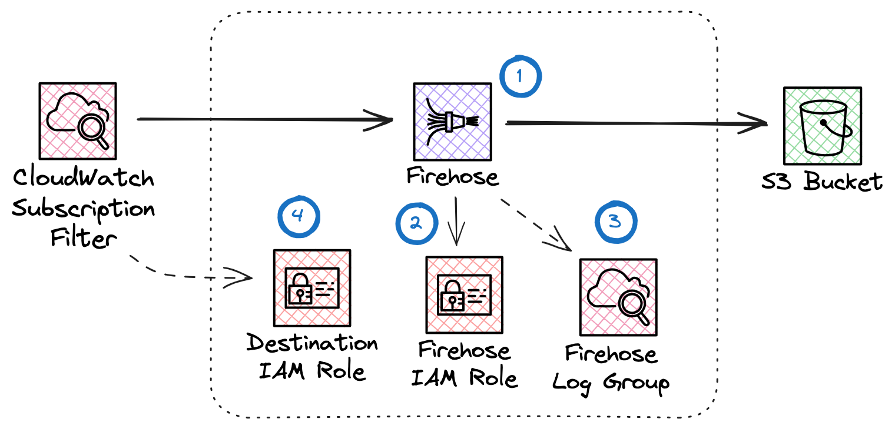
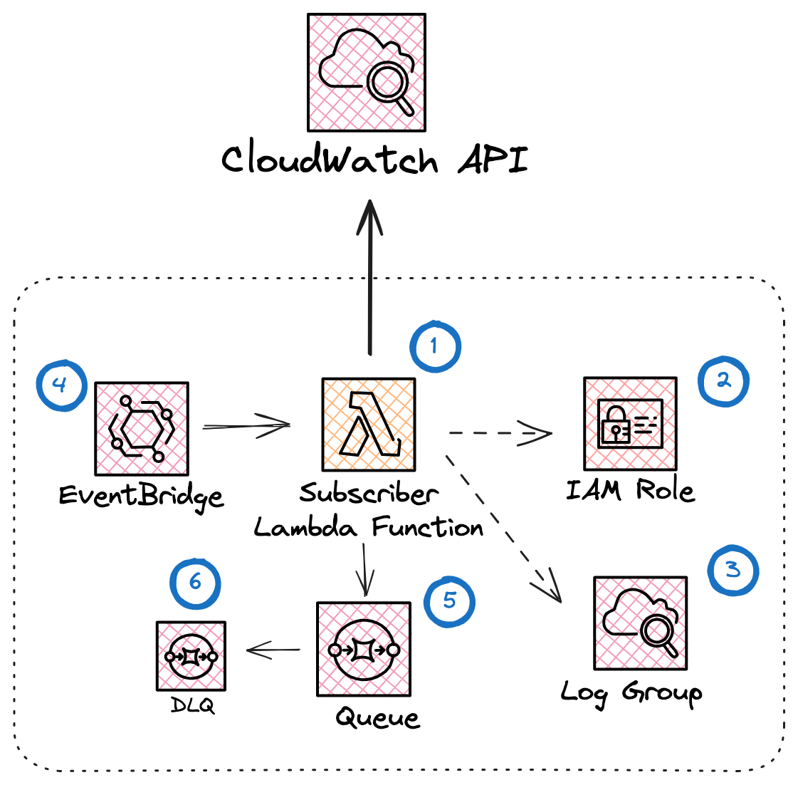

# Observe LogWriter Application

The Observe LogWriter application is an AWS SAM application that writes CloudWatch Log Groups to an S3 bucket. 

Additionally, the stack is capable of subscribing log groups and provides a method for automatically triggering subscription through Eventbridge rules.

## How it works

This app allows for collecting CloudWatch logs. The LogWriter app provisions the following resources:




1. A Kinesis Firehose Delivery Stream which is responsible for writing data to the provided S3 Bucket.
2. An IAM Role which grants the Firehose permission to write to S3.
3. A CloudWatch Log Group where Firehose errors are written to.
4. An IAM Role which grants CloudWatch permission to write to the Firehose.

Once this app is installed, you can configure a subscription filter on a
CloudWatch Log Group which assumes the destination IAM role (4) to forward logs
to the Firehose (1). Logs will be batched and written out to S3.

### Subscription

You can optionally enable automatic log group subscription. Configuring either `LogGroupNamePatterns` or `LogGroupNamePrefixes` parameters will configure these additional resources:



1. A Subscriber Lambda Function that is responsible for querying the CloudWatch API and configuring Log Group Subscription Filters towards the LogWriter Firehose on your behalf.
2. An IAM Role which grants the Subscriber function permission to subscribe Log Groups.
3. A CloudWatch Log Group where function logs are written to.
4. A periodic trigger that requests the Subscriber function to discovery and subscribe applicable log groups, as well as an EventBridge rule to trigger the function on Log Group creation (requires CloudTrail).
5. A Queue to fan out Subscriber execution. During log group discovery, the Subscriber function lists matching log groups and pushes results into SQS. Each subsequent task is processed by a separate function invocation. This allows the subscriber to scale to thousands of log groups without timing out.
6. A Dead Letter Queue captures any failed invocations.

## Template Configuration

### Parameters

| Parameter       | Type    | Description |
|-----------------|---------|-------------|
| **`BucketArn`** | String | S3 Bucket ARN to write log records to. |
| `Prefix` | String | Optional prefix to write log records to. |
| `LogGroupNamePatterns` | CommaDelimitedList | Comma separated list of patterns. We will only subscribe to log groups that have names matching any of the provided strings based on a case-sensitive substring search. See the AWS `DescribeLogGroups` action for more information. To subscribe to all log groups, use the wildcard operator *. |
| `LogGroupNamePrefixes` | CommaDelimitedList | Comma separated list of prefixes. The lambda function will only apply to log groups that start with a provided string. To subscribe to all log groups, use the wildcard operator *. |
| `ExcludeLogGroupNamePatterns` | CommaDelimitedList | Comma separated list of patterns. This parameter is used to filter out log groups from subscription, and supports the use of regular expressions. Uses Go's [regexp](https://pkg.go.dev/regexp) package (RE2 syntax). Multiple patterns are joined with `\|` (OR). Example: `^/aws/lambda/.*,^/aws/ecs/.*` excludes all Lambda and ECS log groups. |
| `DiscoveryRate` | String | EventBridge rate expression for periodically triggering discovery. If not set, no eventbridge rules are configured. |
| `FilterName` | String | Subscription filter name. Existing filters that have this name as a prefix will be removed. |
| `FilterPattern` | String | Subscription filter pattern. |
| `NameOverride` | String | Name of Lambda function. |
| `BufferingInterval` | Number | Buffer incoming data for the specified period of time, in seconds, before delivering it to S3.  |
| `BufferingSize` | Number | Buffer incoming data to the specified size, in MiBs, before delivering it to S3.  |
| `NumWorkers` | String | Maximum number of concurrent workers when processing log groups.  |
| `MemorySize` | String | The amount of memory, in megabytes, that your function has access to. |
| `Timeout` | String | The amount of time that Lambda allows a function to run before stopping it. The maximum allowed value is 900 seconds. |
| `DebugEndpoint` | String | Endpoint to send additional debug telemetry to. |
| `Verbosity` | String | Logging verbosity for Lambda. Highest log verbosity is 9. |

**Note**: If neither `LogGroupNamePatterns` nor `LogGroupNamePrefixes` are provided, the Lambda function will not operate on any log groups. It requires explicit patterns or prefixes to define its scope of operation.

### Outputs

| Output       |  Description |
|-----------------|-------------|
| FirehoseArn | Kinesis Firehose Delivery Stream ARN. CloudWatch Log Groups subscribed to this Firehose will have their logs batched and written to S3. |
| DestinationRoleArn | ARN for IAM Role to be assumed by CloudWatch for log delivery. This value is required when configuring a subscription towards the Firehose Delivery Stream. |
| FirehoseLogGroupName | Firehose Log Group Name. These logs may contain useful information for debugging Firehose delivery to S3. |
| SubscriberArn | Subscriber Function ARN. This function is responsible for log group discovery, filtering and subscription. |
| SubscriberQueueArn | Subscriber Queue ARN. This queue is used by the subscriber function to fan out execution of subscription requests. |
| SubscriberLogGroupName | Subscriber Log Group Name. This log group contains useful information for debugging the Subscriber function. |

## Subscription Request

To explicitly subscribe a set of log groups, invoke the Lambda function with a subscription request like the following:

```json
{
    "subscribe": {
        "logGroups": [
            {"logGroupName": "/aws/foo/example"},
            {"logGroupName": "/aws/bar/example"}
        ]
    }
}
```

### Response Format

The Lambda function returns statistics related to the processing of the log groups:

```json
{
    "subscription": {
        "deleted": 0,
        "updated": 0,
        "skipped": 0,
        "processed": 2
    }
}
```

Counters reflect the processing outcome for the log groups.

## Discovery Request

To subscribe log groups matching specific patterns or prefixes, send a discovery request. For example:

```json
{
    "discover": {
        "logGroupNamePatterns": ["prod"],
        "logGroupNamePrefixes": ["/aws/lambda"]
    }
}
```

This will list all log groups containing "prod" or prefixed with "/aws/lambda". To subscribe to all log groups, use the wildcard "*":

```json
{
    "discover": {
        "logGroupNamePatterns": ["*"]
    }
}
```

### Response Format

The function responds with statistics related to the listed log groups:

```json
{
    "discovery": {
        "logGroupCount": 3,
        "requestCount": 2
    }
}
```

### Inlining Subscriptions

To perform subscriptions in the same invocation as a discovery request, include the `inline` option:

```json
{
    "discover": {
        "inline": true
    }
}
```

The successful invocation response will include subscription stats embedded within the discovery stats.

```json
{
    "discovery": {
        "logGroupCount": 3,
        "requestCount": 2,
        "subscription": {
            "deleted": 0,
            "updated": 0,
            "skipped": 0,
            "processed": 3
        }
    }
}
```

## Automatic subscription through Eventbridge rules

The stack optionally installs eventbridge rules which automatically subscribe log groups the the configured destination. To enable this feature, you must set the `DiscoveryRate` parameter to a valid [AWS EventBridge rate expression](https://docs.aws.amazon.com/eventbridge/latest/userguide/eb-rate-expressions.html) (e.g. `1 hour`).

If this parameter is set, two EventBridge rules are installed:

- a discovery request that will be fire at the desired rate,
- a subscription request will be fired on log group creation. This rule will only fire if CloudTrail is configured within the account and region our subscriber is running in.

Both rules will send requests to the SQS queue, which in turn are consumed by the subscriber lambda.


## Deleting existing subscriptions on uninstall

Uninstalling this app will not clean up configured subscription filters. This is because the time required to uninstall subscription filters varies according to the number of log groups. For a sufficient number of log groups the uninstall timeout would be systematically exceeded, making the app uninstall very brittle.

Given the Firehose will be deleted on uninstall, any existing subscription filters which reference the Firehose will have no effect. If you wish to delete these subscription filters, you should delete them prior to uninstall by setting `ExcludeLogGroupMatches` to `*` and updating your stack. This will work because the inclusion filters `LogGroupPrefixes` and `LogGroupPatterns` determine the set of log groups the Subscriber is allowed to operate on, whereas the exclusion set `ExcludeLogGroupMatches` determines the subset of log groups which cannot have our filter set.

