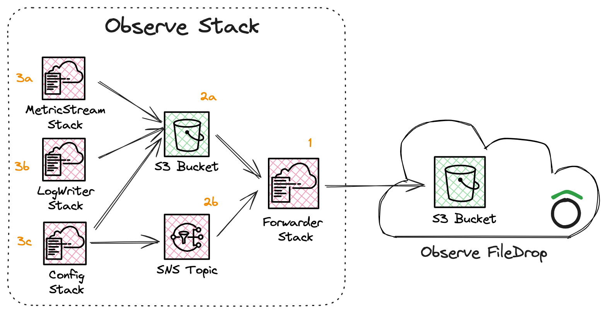

# Observe AWS Stack

The Observe AWS stack is designed to aggregate and forward a wide range of AWS resource data, logs, and metrics to Observe, facilitating comprehensive observability of your AWS environment.

## Overview

This stack centralizes the collection process by deploying necessary AWS services and linking them to ensure seamless data flow towards your Observe Filedrop.

The Observe stack provisions the following components:

1. A [Forwarder stack](forwarder.md) is provisioned which is responsible for writing data into Observe.
2. Two sources are provisioned and subscribed to our Forwarder:
    - a) an S3 bucket where objects can be written to
    - b) an SNS topic where events can be pushed to
3. A set of optional stacks are provisioned which are responsible for dumping data into our two sources:
    - a) a [MetricStream stack](metricstream.md) is responsible for writing CloudWatch Metrics to S3,
    - b) a [LogWriter stack](logwriter.md) is responsible for writing CloudWatch Logs data to S3,
    - c) a [Config stack](config.md) is responsible for setting up AWS Config to write snapshots to S3 and stream changes to SNS.

## Configuration Parameters

| Parameter       | Type    | Description |
|-----------------|---------|-------------|
| **`DestinationUri`** | String | The URI for your destination, e.g.  `s3://bucket-alias/ds101/`. S3 URIs must end in a forward slash. |
| `DataAccessPointArn` | String | The access point ARN for your Filedrop. |
| `ConfigDeliveryBucketName` | String | If AWS Config is already enabled in this account and region, provide the S3 bucket snapshots are written to. |
| `IncludeResourceTypes` | CommaDelimitedList | If AWS Config is not enabled in this account and region, provide a list of resource types to collect. Use a wildcard to collect all supported resource types. |
| `ExcludeResourceTypes` | CommaDelimitedList | Exclude a subset of resource types from configuration collection. This parameter can only be set if IncludeResourceTypes is wildcarded. |
| `LogGroupNamePatterns` | CommaDelimitedList | Comma separated list of patterns. If not empty, the lambda function will only apply to log groups that have names that match one of the provided strings based on a case-sensitive substring search. |
| `LogGroupNamePrefixes` | CommaDelimitedList | Comma separated list of prefixes. If not empty, the lambda function will only apply to log groups that start with a provided string. |
| `ExcludeLogGroupNamePatterns` | CommaDelimitedList | Comma separated list of patterns. This paramter is used to filter out log groups from subscription, and supports the use of regular expressions. |
| `MetricStreamFilterUri` | String | S3 URI containing filters for metrics to be collected by CloudWatch Metrics Stream. If empty, no metrics will be collected. |
| `SourceBucketNames` | CommaDelimitedList | A list of bucket names which the forwarder is allowed to read from. |
| `ContentTypeOverrides` | CommaDelimitedList | A list of key value pairs. The key is a regular expression which is applied to the S3 source (<bucket>/<key>) of forwarded files. The value is the content type to set for matching files. For example, `\.json$=application/x-ndjson` would forward all files ending in `.json` as newline delimited JSON files. |
| `NameOverride` | String | Name of IAM role expected by Filedrop. This role will be created as part of this stack, and must therefore be unique within the account. |
| `DebugEndpoint` | String | OpenTelemetry endpoint to send additional telemetry to. |
